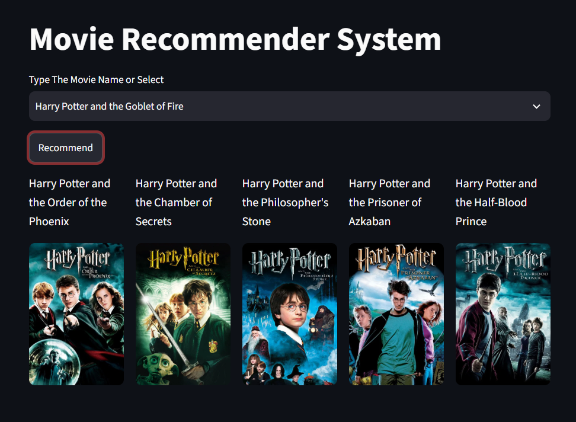

# 🎬 Movie Recommendation System

A content-based **Movie Recommendation System** built with Python and deployed using **Streamlit**. The system recommends movies similar to a user's selected movie and displays their posters using the **TMDB API**.

## 🚀 Live Demo

🔗 **Streamlit App:** *https://movie-recommendation-system-okox01.streamlit.app/*

## 📌 Features

* 🎥 Select a movie from the available movie dataset
* 🤖 Get the top 5 similar movie recommendations
* 🖼️ Fetch and display movie posters using the TMDB API
* ⚡ Interactive web interface built with Streamlit
* ☁️ Deployed as a web application

## 🛠️ Technologies Used

* **Python**
* **Pandas**
* **Streamlit**
* **Requests**
* **Pickle**
* **TMDB API**
* **Jupyter Notebook**

## 🧠 How It Works

The system uses a **content-based recommendation approach**. Movie similarity is calculated from movie features, and a precomputed similarity matrix is used to find the most similar movies.

```text
User selects a movie
        ↓
Find selected movie
        ↓
Retrieve similarity scores
        ↓
Rank similar movies
        ↓
Select top 5 recommendations
        ↓
Fetch posters from TMDB API
        ↓
Display recommendations
```

## 📂 Project Structure

```text
Movie-Recommendation-System/
│
├── app.py                          # Streamlit application
├── movie-recommendation-system.ipynb # Data processing & recommendation development
├── similarity.pkl                  # Precomputed similarity matrix
├── setup.sh                        # Streamlit deployment configuration
├── Procfile                        # Deployment startup command
├── requirements.txt                # Python dependencies
└── .gitignore                      # Ignored files
```

## 🖥️ Application Preview




## ⚙️ Run Locally

Clone the repository and install the dependencies:

```bash
pip install -r requirements.txt
```

Run the Streamlit application:

```bash
streamlit run app.py
```

## 👨‍💻 Author

**Sayed Ahmed Sami**

* GitHub: *https://github.com/okox01*