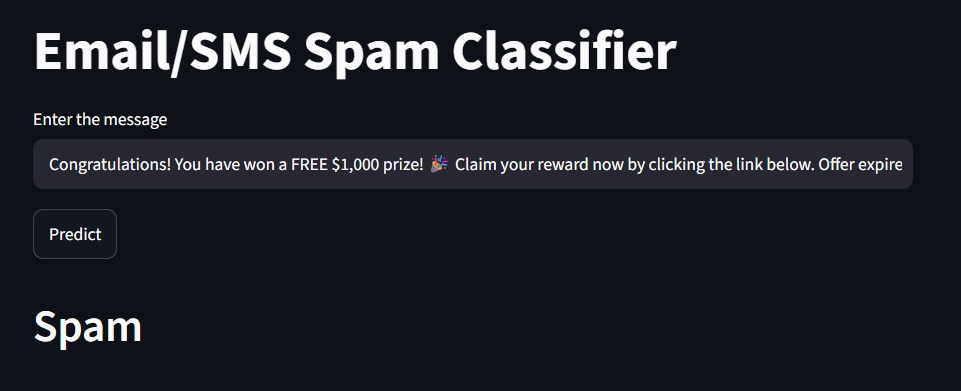

# 📩 SMS Spam Detection

A machine learning web application that classifies SMS messages as **Spam** or **Ham (Not Spam)** using Natural Language Processing (NLP) and machine learning.

## 🚀 Features

* SMS text preprocessing using NLTK
* TF-IDF feature extraction
* Machine learning-based spam classification
* Simple and interactive Streamlit interface
* Real-time message prediction

## 🛠️ Technologies

* **Python**
* **Pandas & NumPy**
* **Scikit-learn**
* **NLTK**
* **Streamlit**

## 📁 Project Structure

```text
Sms-Spam-Detection-Project/
│
├── app.py
├── model.pkl
├── vectorizer.pkl
├── requirements.txt
└── README.md
```

## ▶️ Run Locally

```bash
git clone https://github.com/okox01/machine_learning_projects.git
cd machine_learning_projects/Sms-Spam-Detection-Project
pip install -r requirements.txt
streamlit run app.py
```

## 📸 Interface




## 🌐 Live Demo

**[SMS Spam Detection App](https://sms-spam-detection-okox01.streamlit.app/)**

## 👨‍💻 Author

**MD Sayed Ahmed Sami**

GitHub: [@okox01](https://github.com/okox01)
