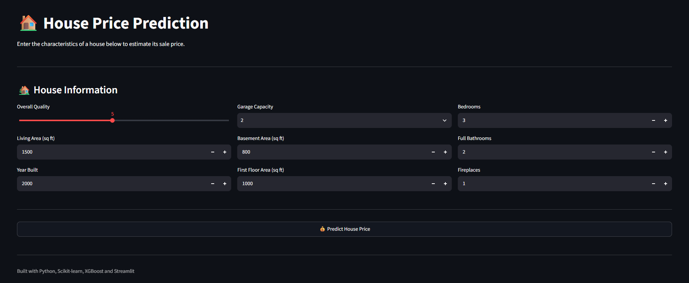

# House Price Prediction

<p align="center">
  
</p>

<p align="center">
  <a href="https://house-price-prediction-okox01.streamlit.app/">
    🚀 <strong>Try the Live App</strong>
  </a>
</p>

An end-to-end Machine Learning project that predicts house sale prices using the Ames Housing dataset.

The project covers the complete ML workflow:

- Exploratory Data Analysis
- Data preprocessing
- Feature engineering and encoding
- Machine Learning model training
- Model evaluation
- Hyperparameter tuning
- Final model training
- Model serialization
- Streamlit deployment

---

## Problem Statement

The goal of this project is to predict the sale price of a house based on its characteristics such as:

- Overall quality
- Living area
- Year built
- Garage capacity
- Basement area
- Number of bedrooms
- Number of bathrooms
- Fireplaces
- Neighborhood
- And other housing features

This is a supervised regression problem.

---

## Dataset

The project uses the **Ames Housing Dataset** from the Kaggle House Prices competition.

The training dataset contains:

- **1460 houses**
- **80 input features**
- **SalePrice** as the target variable

Target:

```text
SalePrice
```

## Exploratory Data Analysis

The EDA stage investigates:

+ Dataset structure
+ Numerical and categorical features
+ Missing values
+ Target distribution
+ Feature correlations
+ Relationship between important features and + + + house prices
+ Potential outliers

Important features include:

+ OverallQual
+ GrLivArea
+ YearBuilt
+ GarageCars
+ TotalBsmtSF
+ 1stFlrSF

---

## Data Preprocessing

Different preprocessing strategies are applied to numerical and categorical features.

### Numerical Features
```
Missing Values
      ↓
Median Imputation
      ↓
StandardScaler
```

### Categorical Features

```
Missing Values
      ↓
Most-Frequent Imputation
      ↓
One-Hot Encoding
```

The preprocessing is implemented using Scikit-learn's:

+ Pipeline
+ ColumnTransformer
+ SimpleImputer
+ StandardScaler
+ OneHotEncoder

---

## Machine Learning Models

Several regression algorithms were investigated:

+ Linear Regression
+ Ridge Regression
+ Random Forest Regressor
+ Gradient Boosting Regressor
+ XGBoost Regressor

The models were evaluated using:

+ MAE
+ RMSE
+ R²

### Evaluation Metrics

MAE

Mean Absolute Error measures the average absolute difference between actual and predicted prices.

RMSE

Root Mean Squared Error gives more importance to larger prediction errors.

R²

R² measures how much of the variance in house prices is explained by the model.

---

## Model Optimization

XGBoost was further investigated using:

+ Cross-validation
+ Randomized hyperparameter search
+ Learning rate tuning
+ Tree depth tuning
+ Number of estimators
+ Subsampling
+ Feature subsampling
+ Minimum child weight

A log-transformed target variable was also investigated because house prices are typically right-skewed.

---

## Baseline Result

The initial XGBoost model achieved approximately:

| Metric |     Score |
| ------ | --------: |
| MAE    | 15,820.93 |
| RMSE   | 25,074.48 |
| R²     |    0.9180 |


Further tuning was performed to improve the model.

---

## Project Structure

```
house-price-prediction/
│
├── app/
│   └── app.py
│
├── data/
│   ├── train.csv
│   ├── test.csv
│   ├── sample_submission.csv
│   └── data_description.txt
│
├── models/
│   ├── house_price_model.pkl
│   └── feature_names.pkl
│
├── notebooks/
│   ├── 01_house_price_eda.ipynb
│   ├── 02_house_price_preprocessing.ipynb
│   ├── 03_house_price_modeling.ipynb
│   ├── 04_house_price_tuning.ipynb
│   └── 05_house_price_final_model.ipynb
│
├── .gitignore
├── README.md
└── requirements.txt

```

---

## Installation

Clone the repository:

```
git clone https://github.com/okox01/Machine_Learning_Projects.git
cd Machine_Learning_Projects/house-price-prediction
```

Create a virtual environment:

```
python -m venv .venv
```

Activate it on Windows:

```
source .venv/Scripts/activate
```

Install dependencies:

```
pip install -r requirements.txt
```

---

## Technologies Used
+ Python
+ Pandas
+ NumPy
+ Matplotlib
+ Seaborn
+ Scikit-learn
+ XGBoost
+ Joblib
+ Streamlit
+ Jupyter Notebook

---

## Future Improvements

Possible improvements include:

+ Feature engineering
+ More extensive hyperparameter optimization
+ Advanced ensemble models
+ Improved Streamlit UI
+ Better handling of user-provided features
+ Prediction confidence/uncertainty estimates
+ Cloud deployment
+ Automated model retraining

---

## Author

**Sayed Ahmed Sami**

GitHub: [@okox01](https://github.com/okox01)

Computer Science student interested in **Machine Learning, Data Science, Artificial Intelligence, Computer Vision, and Research**.

This project is part of my hands-on Machine Learning portfolio, focused on building practical end-to-end ML systems from data exploration and model development to deployment.